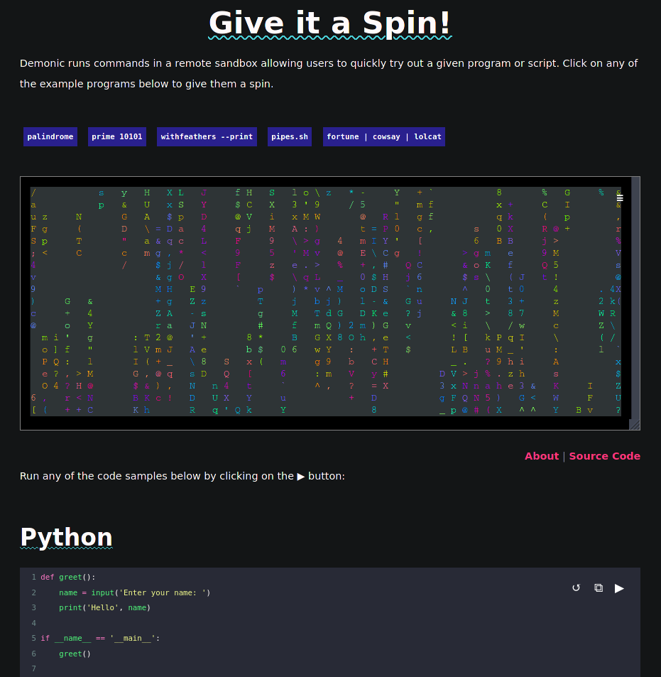
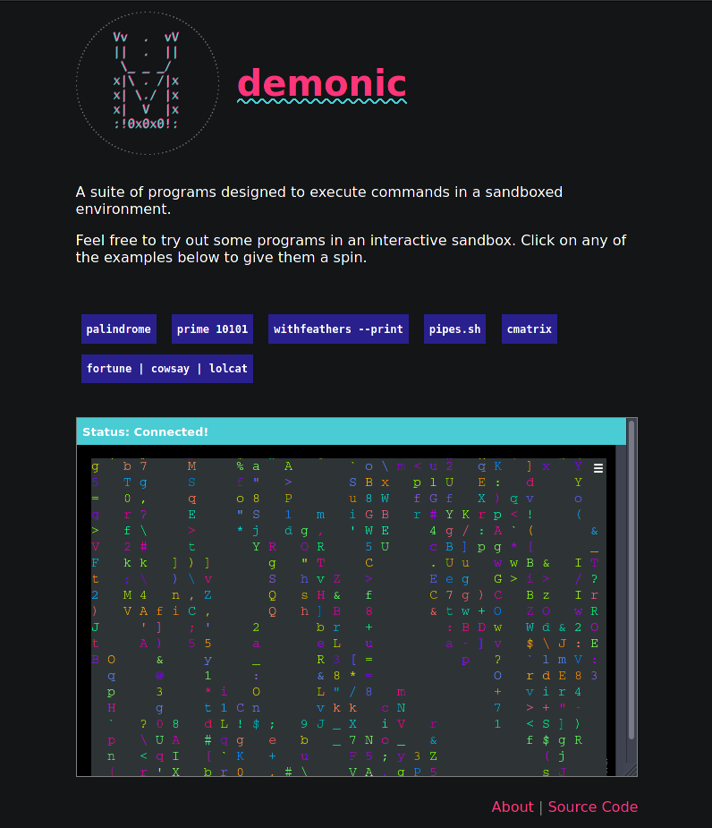

# demonic-web

A web-based terminal for running commands and code snippets in a sandboxed environment.

Try it out at [liambeckman.com/code/demonic](https://liambeckman.com/code/demonic).

[](https://liambeckman.com/code/demonic)

## Installation

```sh
# get code
git clone https://github.com/lbeckman314/demonic-web
cd demonic-web

# install dependencies
npm install

# bundle webpack
npm run build
```

Upon opening `site/client.html` in your favorite browser you'll have an example of the demonic web client sharing commands and output with the demonic server.



# Uninstallation

```sh
# remove this directory
rm -rf demonic-web
```
# See Also

- [Demonic-Server](https://github.com/lbeckman314/demonic-web): The backend for this client.
- [Demonic-Docs](https://github.com/lbeckman314/demonic-docs): Integrates demonic-web into your documentation.


