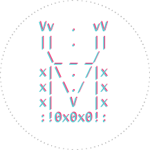
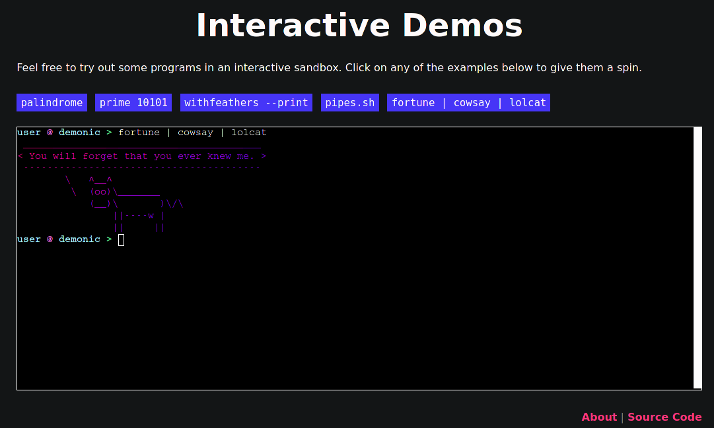
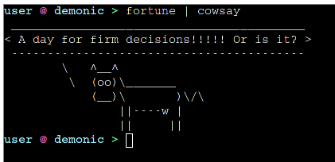

# demonic web

A web-based client for running commands and code snippets in a sandboxed environment.

[](https://liambeckman.com/code/#interactive-demos)

## Installation

```sh
# get code
git clone https://github.com/lbeckman314/demo-web
cd demo-web

# install dependencies
npm install

# bundle webpack
npm run build
```

Upon opening 'client.html' in your favorite browser you'll have an example of the demonic web client sharing commands and output with the demonic server.



# Uninstallation

```sh
# remove this directory
rm -rfI demo-docs
```

